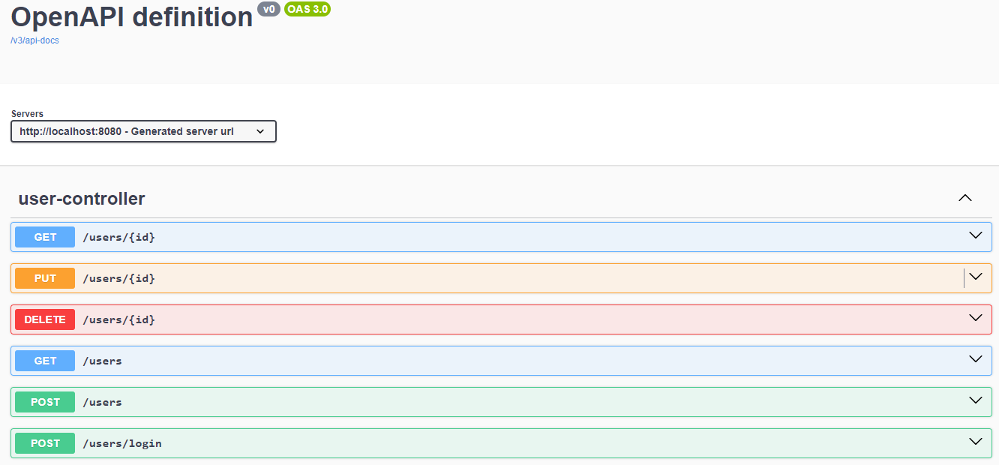

## Messaging Project

Este projeto é uma aplicação Backend desenvolvida com Spring Boot, focado no uso de mensageria para o processamento assíncrono do processo de envio de emails.

## Arquitetura
O projeto consiste em um serviço que faz o gerenciamento dos usuários, e se comunica através do rabbitmq com outro serviço que consome essas mensagens,
e faz o envio de email através do mailtrap (sandbox) para o usuário que foi criado, atualizado ou deletado informando essa mudança.


## Funcionalidades
- CRUD de Usuários
- Autenticação JWT
- Swagger/OpenAPI
- RabbitMQ
- Worker Consumidor
- Envio de Email
- MailTrap sandbox (teste)

## Stack
- Java
- Spring Boot
- Rabbitmq
- Postgres
- Docker
- Spring Security
- Maven
- Intelij
- Mailtrap
- Git

## Swagger


## Como Executar

### Requisitos 
- Conta No Mailtrap
- Docker e Docker Compose <br/>

> **Windows** O Docker Desktop é necessário, e já inclui Docker e Docker Compose, basta baixa-lo e inicia-lo

### 1. Abra o terminal 

### 2. Clone o Repositório

```bash
git clone https://github.com/MatheusHenriqueSouzaSantos/MessagingProject
```

### 3. Entre na pasta do projeto

```bash
cd MessagingProject
```

### 4. Crie o Arquivo das Variáveis de Ambiente 

#### Linux
```bash
cp .env.example .env
```

#### Windows 
```cmd
copy .env.example .env  
```

### 5. Obtenha as credencias do Sandbox do Mailtrap
Acesse o [Mailtrap](https://mailtrap.io), vá em **Sandboxes** depois em **My Sandbox** e copie o **Username** e o **Password** da sua sandbox. Essas credenciais são usadas para envio de e-mails via SMTP.


### 6. Acesse o arquivo .env e Adicione os Valores das Variáveis de Ambiente
No arquivo terá essas linhas que você deverá subistituir pelos valores obtidos no passo anterior: <br/>
-MAIL_USERNAME:YOUR_MAILTRAP_USERNAME <br/>
-MAIL_PASSWORD:YOUR_MAIL_TRAP_PASSWORD <br/>


### 7. Rodar a aplicação
Após isso, basta abrir o terminal e executar o seguinte comando:

```bash
docker compose up --build
```

Agora a aplicação já esta rodando na porta **8080**, e as rotas podem ser acessadas via swaggerUI em: http://localhost:8080/swagger-ui/index.html
